# Collaboration with Git

Patrick McCann

Research Computing, University of St Andrews

research-computing@st-andrews.ac.uk

---

## Software Carpentry

Much of this presentation will draw on the [Software
Carpentry](https://software-carpentry.org/) lesson [Version Control with
Git](https://swcarpentry.github.io/git-novice/).

That lesson goes into topics in more detail, with examples and exercises. There
are regular Software Carpentry workshops at the University, open to all
researchers.

notes:

The next workshop is on 29th and 30th of November, covering the Unix Shell, Git
and Python.

---

## Why use Version Control?

<p class="stretch">
  
</p>

--

Version control systems record the details of changes made to a base version of
a document or documents.

As well as  allowing you to track changes over time - and to move back and
forward between versions - they allow collaborators to maintain differing
versions and provide mechanisms for resolving those differences.

--

You get to decide what changes get grouped together in a _commit_, marking a
new version.

A project's commit history and metadata make up a _repository_. Repositories
can be kept in sync between different computers.

---

## Why use Git?

<p class="stretch">
  
</p>

--

Version control systems have been around since the 1980s - you may have heard
of e.g. CVS or Subversion.

Modern systems like [Git](https://git-scm.com/) and Mercurial are
_distributed_, so they don't need a central server to host repositories.

--

Git has become the de facto standard.

---

## Why use GitHub?

<p class="stretch">
  
</p>

--

[GitHub.com](https://github.com) has become the most popular platform for
hosting Git Repositories - especially public repositories for open-source
software.

Others platforms include [BitBucket](https://bitbucket.org/) and
[GitLab.com](https://gitlab.com/).

notes:

These days, GitHub lets you create private repositories for free, as well as
public ones.

--

The University has an instance of [GitLab](https://gitlab.st-andrews.ac.uk/)
(VPN) available to researchers - this is not available to users outside the
University.

<p class="stretch">
  
</p>

notes:

You may want to use this if, for some reason, it's not appropriate to have your
code on an external system like GitHub.

All projects on our GitLab belong to groups, rather than individuals. There's a
Biology group, under which sub-groups can be created - if you're interested in
this, get in touch with Clint Blight.

--

GitHub also provides some additional features which are particularly useful to
academic researchers.

---

## Using Git

<p class="stretch">
  
</p>

https://xkcd.com/1597/

notes:

Hopefully today we can get past learning "what to do to make Git work" and
understand some of the concepts.

--

There are a number of ways to work with Git on your computer:

- The command-line interface referenced in the XKCD cartoon
- Terminal based user interfaces like
  [gitui](https://github.com/extrawurst/gitui) and
  [lazygit](https://github.com/jesseduffield/lazygit/)
- Graphical user interfaces like [GitHub Desktop](https://desktop.github.com/)
  and [SourceTree](https://www.sourcetreeapp.com/)
- As a feature (or plugin) of development tools and editors like RStudio.

--

Other user interfaces can be considered as wrappers around the command-line
interface. They tend to hide some of the details of how Git works.

This presentation includes screenshots from GitHub Desktop alongside the
equivalent commands.

---

## A Git Repository

- <ion-icon name="folder-open-outline"></ion-icon> my-project
  - <ion-icon name="folder-outline"></ion-icon> .git
  - <ion-icon name="folder-outline"></ion-icon> data
  - <ion-icon name="folder-outline"></ion-icon> src
  - <ion-icon name="folder-outline"></ion-icon> test
  - <ion-icon name="document-outline"></ion-icon> .gitignore
  - <ion-icon name="document-outline"></ion-icon> LICENSE.txt
  - <ion-icon name="document-outline"></ion-icon> README.md
  - <ion-icon name="document-outline"></ion-icon> run.sh

notes:

If you're on a Mac (or using Linux), filenames starting with a '.', like .git
and .gitignore, are hidden by default.

--

<div class='left' style='float:left;width:50%'>

- <ion-icon name="folder-open-outline"></ion-icon> my-project
  - <ion-icon name="folder-outline"></ion-icon> **.git**
  - <ion-icon name="folder-outline"></ion-icon> data
  - <ion-icon name="folder-outline"></ion-icon> src
  - <ion-icon name="folder-outline"></ion-icon> test
  - <ion-icon name="document-outline"></ion-icon> .gitignore
  - <ion-icon name="document-outline"></ion-icon> LICENSE.txt
  - <ion-icon name="document-outline"></ion-icon> README.md
  - <ion-icon name="document-outline"></ion-icon> run.sh

</div>

<div class='right' style='float:right;width:50%'>

**.git** is where Git stores the metadata about the project.

We (almost) never edit its contents directly.

Technically, **.git** is the _Git Repository_, but you will often see
**my-project** described as such.

</div>

--

<div class='left' style='float:left;width:50%'>

- <ion-icon name="folder-open-outline"></ion-icon> my-project
  - <ion-icon name="folder-outline"></ion-icon> .git
  - <ion-icon name="folder-outline"></ion-icon> data
  - <ion-icon name="folder-outline"></ion-icon> src
  - <ion-icon name="folder-outline"></ion-icon> test
  - <ion-icon name="document-outline"></ion-icon> **.gitignore**
  - <ion-icon name="document-outline"></ion-icon> LICENSE.txt
  - <ion-icon name="document-outline"></ion-icon> README.md
  - <ion-icon name="document-outline"></ion-icon> run.sh

</div>

<div class='right' style='float:right;width:50%'>

Many Git-managed projects will have a **.gitignore** file, which allows us to
exclude some files from version control.

</div>

notes:

Git ignores empty folders by default.

---

## Initialising

```shell
$ cd /Users/paddy/Documents/GitHub
$ mkdir my-project
$ cd my-project
$ git init
```

<p class="stretch">
  
</p>

notes:

The GitHub Desktop screenshot is equivalent to the commands above, where we
make a folder for the project, navigate to it and initialise the repository.

Note that GitHub Desktop is encouraging you to include a README and a License -
it's good practice to have both, but I'm adding them manually. We'll come back
to how to ignore stuff in a while.

--

```shell
$ ls -a
.       ..      .git
$ git status
On branch main
nothing to commit, working tree clean
```

<p class="stretch">
  
</p>

notes:

From the commands at the top, we can see that initialising creates a '.git'
folder. GitHub Desktop doesn't show us that. Other than that, the folder is
empty - we need to add some files before we can do anything more with Git.

---

## Adding and Committing

We can add a file to our project folder using any text editor or, indeed, any
piece of software which allows us to save files.

Here, we've used a text editor to create a README file using markdown syntax
and save it as `README.md`.

--

```shell
$ ls -a
.       ..      .git    README.md
$ cat README.md
# My Project

This is an example project to illustrate the use of Git for
collaboration in a research context.
```

notes:

We can see here the content of `README.md`.

--

<p class="stretch">
  
</p>

notes:

We can see here the content of `README.md`. In GitHub Desktop, the new content
in the file is highlighted in green with a plus symbol on the left-hand side.

--

```shell
$ git status
On branch main
Untracked files:
  (use "git add <file>..." to include in what will be committed)
        README.md

nothing added to commit but untracked files present (use "git add" to track)
$ git add README.md
$ git status
On branch main
Changes to be committed:
  (use "git restore --staged <file>..." to unstage)
        new file:   README.md

```

notes:

On the command line, we need to add the file before we can commit it. This is
somewhat hidden in GitHub Desktop, with just the checkbox for the file checked
by default.

--

```shell
$ git commit -m 'Adds basic README describing project'
```

<p class="stretch">
  
</p>

notes:

Finally, we make the commit, including a message describing the change.

Note we can commit multiple files at a time.

---

## Viewing the Log

<p class="stretch">
  
</p>

notes:

We've jumped ahead here, and I've added a few more files and folders. You
can see the details of the commits on the left.

--

```shell
$ git log
commit c8bacfbdfd15e5f0924dde8461662ba8fdb676da
Author: Patrick McCann <pgm5@st-andrews.ac.uk>
Date:   Mon Nov 1 15:36:13 2021 +0000

    Adds bash script to run analysis

commit 3fa305a9d4e76e9a4bb58f724a15c2f5ae032edc
Author: Patrick McCann <pgm5@st-andrews.ac.uk>
Date:   Mon Nov 1 15:35:39 2021 +0000

    Adds test script

commit 382abfc258f398954ad897e52ff224a75188a7ca
Author: Patrick McCann <pgm5@st-andrews.ac.uk>
Date:   Mon Nov 1 15:32:32 2021 +0000

    Adds analysis script

commit d9342395f59895e818244e9ffbfcd3e52ee3f848
Author: Patrick McCann <pgm5@st-andrews.ac.uk>
Date:   Mon Nov 1 15:32:06 2021 +0000

    Adds input data

commit 36e0ef19bb5a33d9dffab84e807530acc360a2b5
Author: Patrick McCann <pgm5@st-andrews.ac.uk>
Date:   Mon Nov 1 15:31:26 2021 +0000

    Adds MIT license

commit 7145797baccfb6f07e3639745422ce97d383ee82
Author: Patrick McCann <pgm5@st-andrews.ac.uk>
Date:   Fri Oct 29 15:33:38 2021 +0100

    Adds basic README describing project

commit 3e2a35919aa25a688d25528c5014251cf8c5ed67
Author: Patrick McCann <pgm5@st-andrews.ac.uk>
Date:   Tue Oct 26 16:44:19 2021 +0100

    Initial commit
```

notes:

On the command line, we can see the unique identifier for each commit.

--

```shell
$ git diff HEAD~1 HEAD
diff --git a/run.sh b/run.sh
new file mode 100755
index 0000000..a84485c
 --- /dev/null
 +++ b/run.sh
@@ -0,0 +1,4 @@
+#!/bin/bash
+
+cp data/input.csv data/output.csv
+python src/analysis.py
```

notes:

We can use the `git diff` command to view the differences between two commits.
`HEAD` refers to the latest commit, `HEAD~1` to the previous one.

--

<p class="stretch">
  
</p>

https://xkcd.com/1296/

notes:

Good commit messages make the history much more useful. I think we all fall
down on this, though. It's generally a good idea for the commit message to
convey something that may not be obvious from looking at the change itself e.g.
the motivation.

---

## Ignoring Things

There are situations where we have a file or files in our repository which we
don't want to place under version control e.g.

- The results of analysis.
- Anything containing a password or other sensitive data.
- Files created by your tools which aren't really part of the project.

notes:

We saw earlier that GitHub Desktop offers an 'Ignore' option when creating a
Git Repository. This allows you to apply a set of rules according to what kind
of project you have.

--

<p class="stretch">
  
</p>

```shell
$ git status
On branch main
Untracked files:
  (use "git add <file>..." to include in what will be committed)
        data/output.csv

nothing added to commit but untracked files present (use "git add" to track)
$ git ignore data/output.csv
Adding pattern(s) to: .gitignore
... adding 'data/output.csv'
```

notes:

Here we're ignoring the output of an analysis.

We can ignore an individual file or files matching a particular pattern.

--

<p class="stretch">
  
</p>

```shell
$ git status
On branch main
Untracked files:
  (use "git add <file>..." to include in what will be committed)
	.gitignore

nothing added to commit but untracked files present (use "git add" to track)
```

notes:

We need to commit the changes to the .gitignore file.

---

## Remotes

So far, everything has been on our own computer. This is useful, but Git really
comes into its own when collaborating with others.

To do that, we need to keep our projects in sync between multiple computers
(also useful if you work from multiple computers yourself).

Your computer is _local_, one with which you are syncing is a _remote_.

notes:

Even if you're not collaborating, this provides a backup

--

You can, in principle, have Git on your computer communicate directly with your
colleagues' to keep things in sync, but it's generally easier to sync with
another location to which you all have access.

That other location could be a desktop computer in your office or it could be
GitHub (or GitLab) - as far as Git is concerned there isn't really a
difference.

notes:

Though GitHub or GitLab provide lots of additional features.

--

### Creating a repo on GitHub.com

<div class='left' style='float:left;width:50%'>

<p class="stretch">
  
</p>

</div>

<div class='right' style='float:right;width:50%'>

<p class="stretch">

</p>

</div>

notes:

We use the plus icon in the top right-hand corner of the GitHub web interface
to create a new repository. Note that the various options in the repository
creation form are similar to those seen when creating a repository in GitHub
desktop.

--

<p class="stretch">
  
</p>

notes:

After creating the repository, GitHub provides instructions on how to proceed.

--

### Publishing a repo from GitHub Desktop

<p class="stretch">
  
</p>

notes:

**Alternatively**, you can publish from GitHub Desktop without creating the
repository on GitHub manually. This isn't possible from other clients.

--

### The repo on GitHub

<p class="stretch">
  
</p>

notes:

After publishing from GitHub Desktop, this is how the repository looks on
GitHub.com. Note that the content of the README file is displayed below the
file listing.

---

## Pushing

<p class="stretch">
  
</p>

notes:

We push commits from our local git to a remote, and pull in the other
direction.

We can see here that we've added some information about licensing to the README
file (note, this is not a substitute for a full LICENSE file).

--

```shell
$ git status
On branch main
Your branch is up to date with 'origin/main'.

Changes not staged for commit:
  (use "git add <file>..." to update what will be committed)
  (use "git restore <file>..." to discard changes in working directory)
	modified:   README.md

no changes added to commit (use "git add" and/or "git commit -a")
$ git diff
diff --git a/README.md b/README.md
index e0a3173..b9fd878 100644
 --- a/README.md
 +++ b/README.md
@@ -2,3 +2,6 @@

 This is an example project to illustrate the use of Git for
 collaboration in a research context.
+
+Copyright 2021 University of St Andrews. Licensed under the terms of the MIT
+License.
```

notes:

We push commits from our local git to a remote, and pull in the other
direction.

We can see here that we've added some information about licensing to the README
file (note, this is not a substitute for a full LICENSE file).

--

After committing...

```shell
$ git status
On branch main
Your branch is ahead of 'origin/main' by 1 commit.
  (use "git push" to publish your local commits)

nothing to commit, working tree clean
$ git push
Enumerating objects: 5, done.
Counting objects: 100% (5/5), done.
Delta compression using up to 4 threads
Compressing objects: 100% (3/3), done.
Writing objects: 100% (3/3), 429 bytes | 429.00 KiB/s, done.
Total 3 (delta 1), reused 0 (delta 0), pack-reused 0
remote: Resolving deltas: 100% (1/1), completed with 1 local object.
To https://github.com/pgmccann/my-project.git
   2bf80ab..3ec775a  main -> main
```

<p class="stretch">
  
</p>

notes:

Once we commit that change, we can push it to GitHub.

--

<p class="stretch">
  
</p>

notes:

After pushing we can see the updated README on GitHub.com (both commit and
content).

---

## Pulling

Let's add a License
[badge](https://gist.github.com/lukas-h/2a5d00690736b4c3a7ba) using GitHub's
editing interface.

[](https://opensource.org/licenses/MIT)

notes:

We can edit files directly on GitHub.com - then we'll need to pull the changes
to our local copy.

You will often see badges like this at the top of READMEs in GitHub
repositories - highlighting the license used, indicating the results of
testing, inviting you to donate, and more.

--

<p class="stretch">
  
</p>

notes:

Here, we've opened the README in GitHub's editing interface.

--

<p class="stretch">
  
</p>

notes:

We've added a line to the top of the README for the badge.

--

<p class="stretch">
  
</p>

notes:

To save the changes in GitHub.com, we have to make a commit. So, we can't
commit changes to multiple files at once using this interface.

--

<p class="stretch">
  
</p>

notes:

Here, we can see the badge displayed at the top of the README on GitHub.com.

--

```shell
$ git status
On branch main
Your branch is up to date with 'origin/main'.

nothing to commit, working tree clean
```

<p class="stretch">
  
</p>

notes:

At this point, our local copy is unaware of the change.

--

<p class="stretch">
  
</p>

```shell
$ git pull
Updating 3ec775a..658258a
Fast-forward
 README.md | 2 ++
 1 file changed, 2 insertions(+)
```

notes:

After clicking 'Fetch origin' in GitHub Desktop, it tells us that there is a
change on the remote, which we can pull.

Note that the remote has been given the (default) label 'origin'. Remotes are
labelled as you can have more than one, and may need to differentiate.

--

<p class="stretch">
  
</p>

notes:

After pulling, we can see the change reflected in locally.

---

## Managing access on GitHub

My project is in a public GitHub repository, so anyone can see it - but only I
can make commits, either by editing on the GitHub website, or pushing from my
computer.

But I can add collaborators.

notes:

We have the tools at this point to start thinking about collaborating.

--

<p class="stretch">
  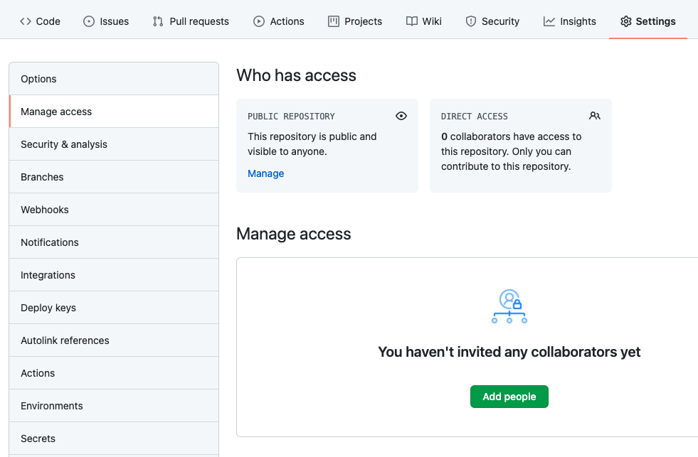
</p>

--

<p class="stretch">
  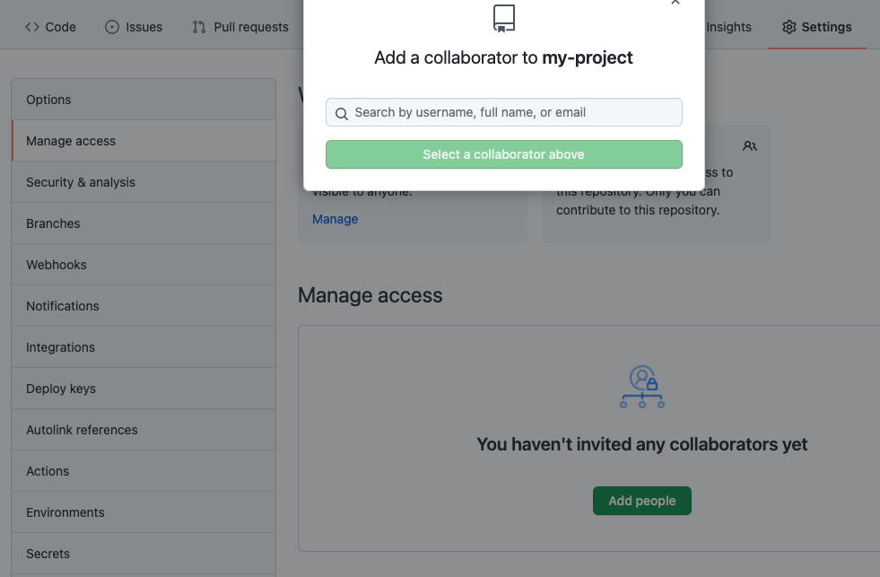
</p>

--

<p class="stretch">
  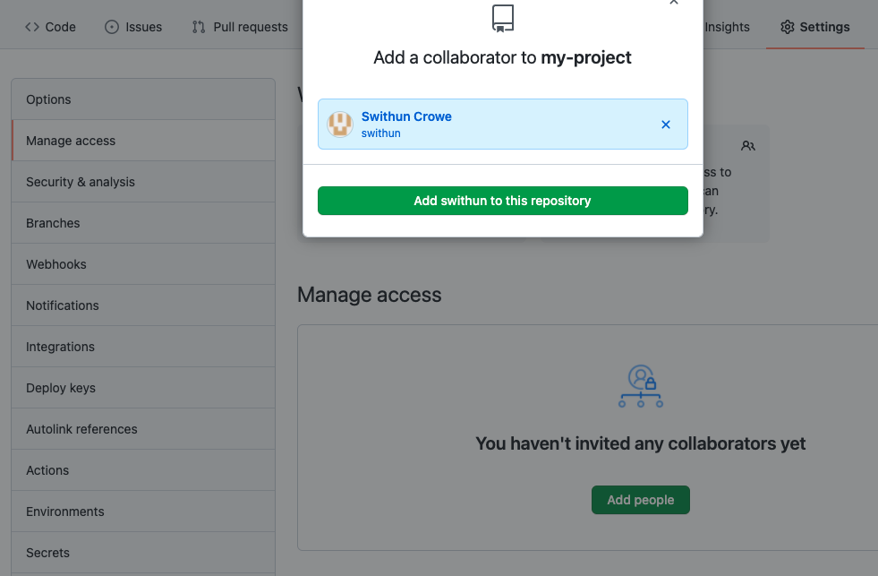
</p>

--

<p class="stretch">
  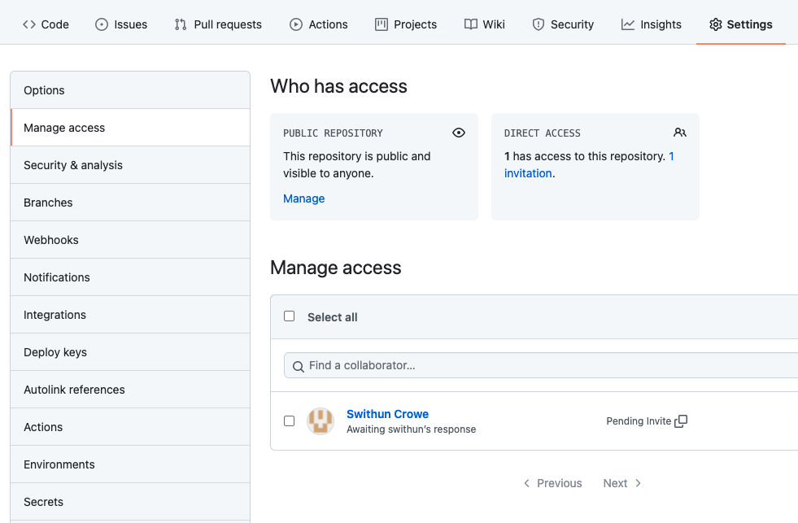
</p>

--

<p class="stretch">
  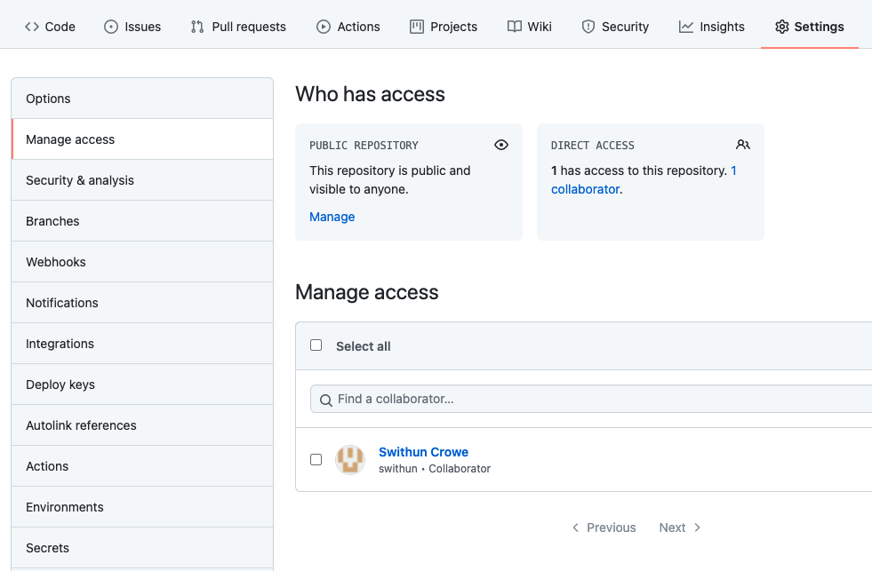
</p>

notes:

You can also assign different roles to collaborators, constraining what they
can do. This is a bit more obvious in GitLab.

---

## Merging

Knowing how to push to and pull from an remote is enough to enable
collaboration - later we'll come on to some techniques which can make things
easier.

We can run into complications if collaborators are working on a project at the
same time, requiring commits to be _merged_.

notes:

I've effectively been collaborating with myself, so far - effectively, me on
GitHub.com and me locally can be considered to be two separate users.

I pulled a change which I made on GitHub.com, but it could just as easily have
been a change pushed to GitHub by a collaborator.

This topic is where Software Carpentry workshops can get slightly chaotic, but
where the type-along format works really well.

--

Git does as much as possible to make this painless.

It will handle merges automatically if the commits to be merged involve changes
to different files, and even if the changes are in different parts of the same
file.

If the changes are to the same part of a file, the merge will need to be
performed manually.

notes:

Git really only asks us to intervene in a merge if it can't work out what to
do. Here, I'm only going to cover the more involved scenario.

--

<p class="stretch">
  
</p>

notes:

Here, I've made a change on GitHub.com, changing line 8 of the README. Note
that Git looks at changes line by line - as far as it's concerned, the old
version of the line has been replaced by the new one.

--

<p class="stretch">
  
</p>

notes:

Here, I've made a different change to the same line in my local copy. Note that
I haven't pulled the change made on the remote before doing so.

--

<p class="stretch">
  
</p>

notes:

I've tried to push my local change to GitHub.com - but this isn't possible as
there are commits on the remote which are not present locally. So I click
'Fetch'.

--

<p class="stretch">
  
</p>

notes:

After fetching, GitHub Desktop invites me to pull the changes from GitHub.com,
as we've seen before.

--

<p class="stretch">
  
</p>

notes:

When I attempt to pull from the remote, I'm told I need to resolve a conflict
in the README.

--

<p class="stretch">
  
</p>

notes:

We can see here how Git indicates a conflict, with the repeated 'less than',
'equals' and 'greater than' symbols. This looks a little intimidating, but it's
really just a way of showing which version came from which commit. All we need
to do is edit README.md to get it the way we want it - whatever that might be.

--

<p class="stretch">
  
</p>

notes:

Here, I've edited the file to include both changes, and I'm about to commit.

--

<p class="stretch">
  
</p>

notes:

Now I've got 2 local commits to push to the remote - the original local commit,
and a _merge commit_. I can now push this to the remote.

--

<p class="stretch">
  
</p>

notes:

I've successfully pushed to the remote.

--

<p class="stretch">
  
</p>

notes:

And you can see the changes in the README on GitHub.com.

---

## Git in RStudio

<p class="stretch">
  
</p>

https://swcarpentry.github.io/git-novice/14-supplemental-rstudio/index.html

notes:

Before we start looking at branching and forking, I'm just going to quickly
mention the use of Git within RStudio. I'm not an R user myself, but I've
linked here to the Software Carpentry material on this.

In this screenshot, I've opened my existing project in RStudio, which now shows
the Git menu at the top.

As well as adding an Rproj file, this automatically added some R-specific rules
to the .gitignore file.

---

## Branching

_Branches_ in Git allow different versions of a project to exist in parallel,
with the repository keeping track of all of them.

Commits can be made to a branch irrespective of what's happening on any others.

Branches can be merged, with any conflicts resolved in the same way we've
already seen.

notes:

You can quickly and easily move between branches on your computer or on GitHub.

--

There are a number of reasons you might use branches, including:

- To try something out without changing the content of the main branch
- To work on different things - whether it's one person switching between them
  or collaborators working in parallel.

notes:

Maybe you want to experiment with some new way of doing things, so you do it in
a branch to avoid risking damaging changes being made to the application on the
main branch.

You might be working on a branch to add some new feature, then have to open a
new one to fix a bug.

`main` is just a branch - it's just the default name for the branch created
when the repository is initialised (used to be 'master', you might see this in
some repositories).

--

Imagine two researchers are collaborating on a piece of data analysis software.
One is working on new visualisations, and the other is working on optimising
the analysis.

<p class="stretch">
  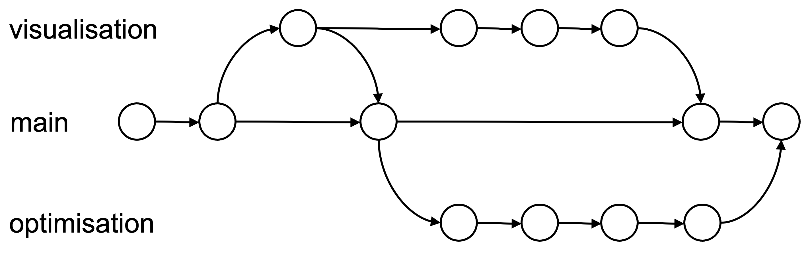
</p>

Some say you should never work directly on the main branch.

notes:

Here we can see a branch from main created to work on visualisation. A single
commit is made to that branch, which is then merged into main. However, the
visualisation branch persists, and further work is done on it before it is
merged into main again.

Meanwhile, another branch on optimisation is created in parallel, and worked on
independently.

Merging occurs in much the same way as we have already seen - Git will attempt
to merge automatically, but we may have to resolve conflicts in the same way as
before.

--

<p class="stretch">
  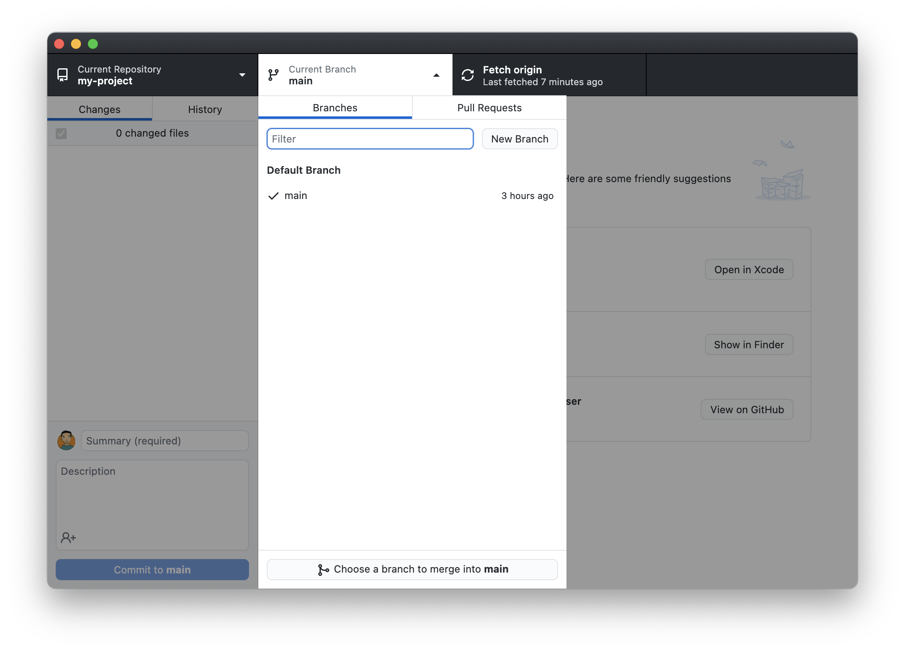
</p>

notes:

Here we can see where branches are listed in GitHub Desktop. At this point, we
just have 'main'.

--

<p class="stretch">
  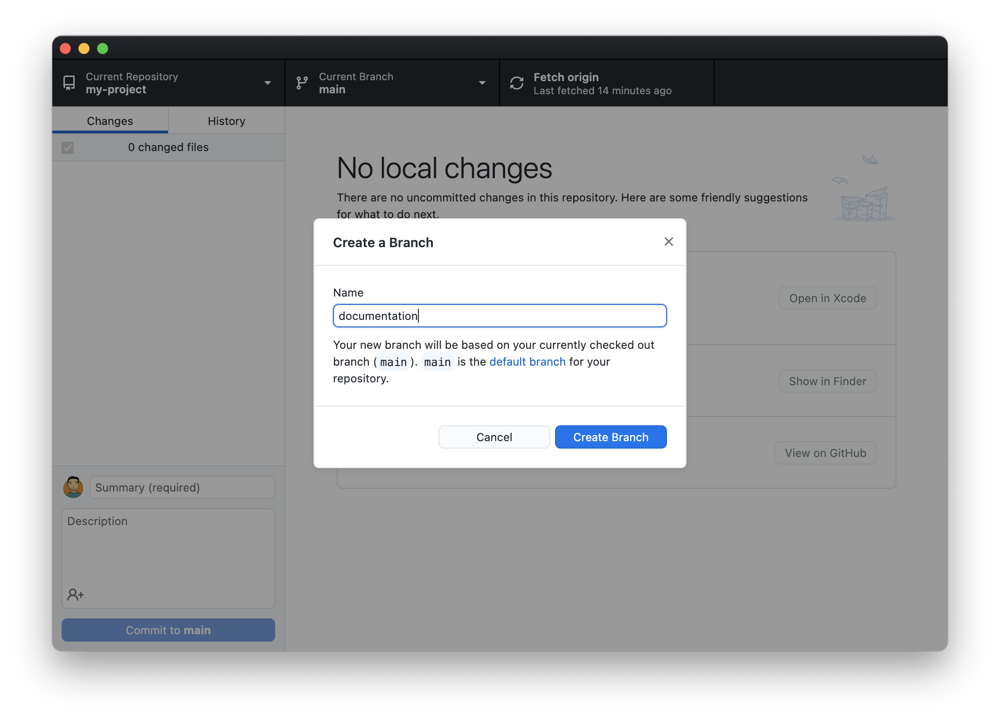
</p>

notes:

I've clicked on 'New branch' and am asked to give it a name. GitHub Desktop
makes clear that it's based on 'main' - when we view the history in our new
branch, we'll see all the commits made in 'main' up to the point it branched
off.

--

<p class="stretch">
  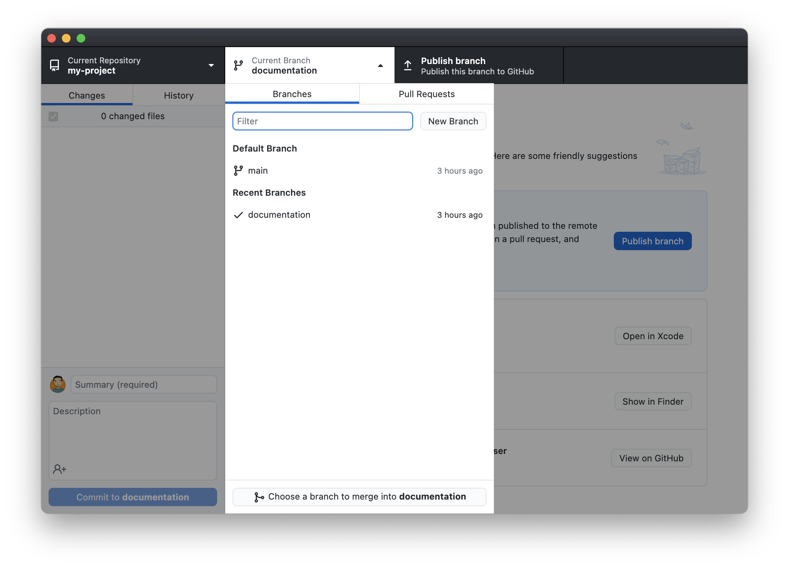
</p>

notes:

We can see the new branch listed in GitHub - and that it's our current branch.

--

<p class="stretch">
  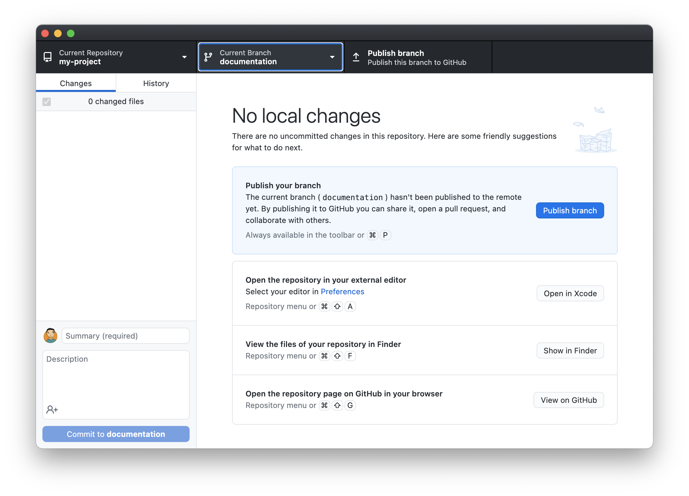
</p>

notes:

GitHub Desktop makes very clear that we're using our new 'documentation'
branch: see the commit button as well as the menu at the top.

--

<p class="stretch">
  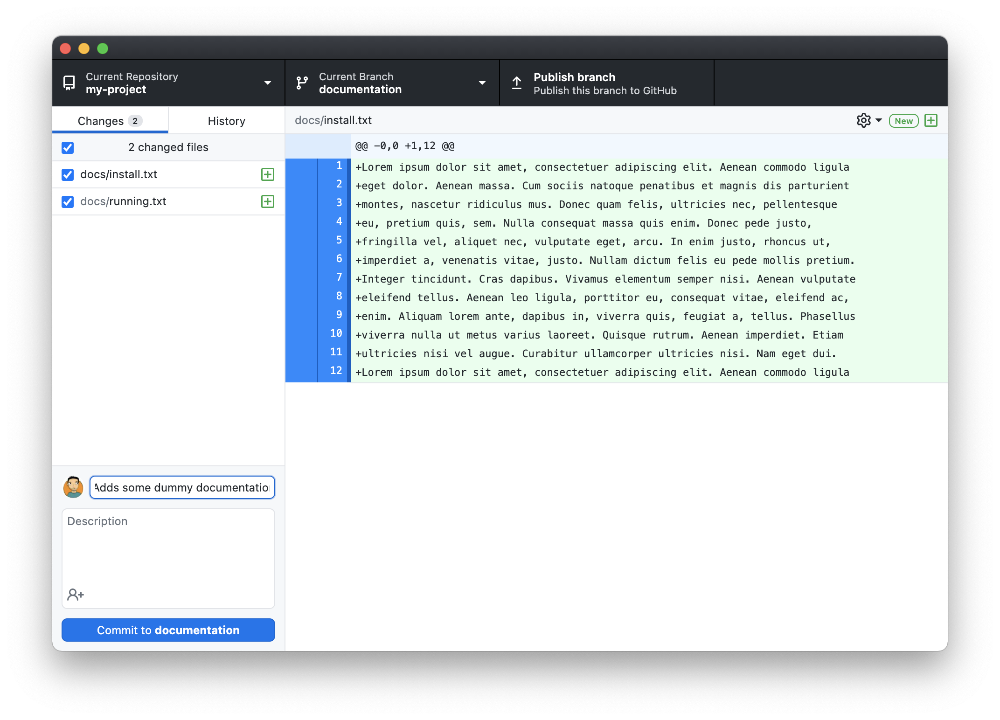
</p>

notes:

Here, I've added a couple of files to a folder called 'docs'. I'm ready to
commit to the documentation branch.

--

<p class="stretch">
  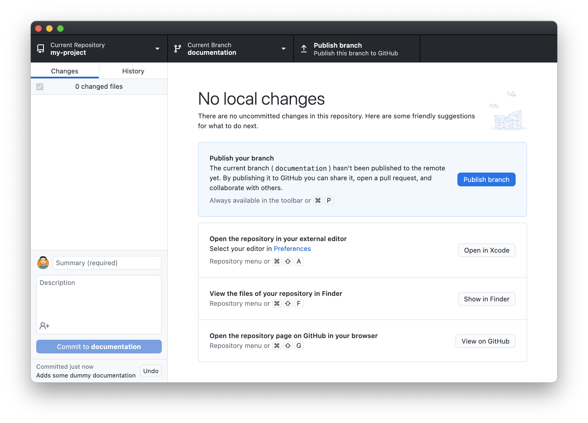
</p>

notes:

Now I'm ready to publish the branch to GitHub.

--

<p class="stretch">
  
</p>

notes:

I've published from GitHub Desktop without any issues.

--

<p class="stretch">
  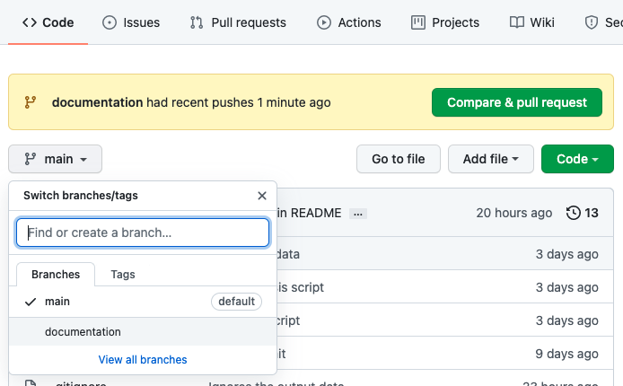
</p>

notes:

On GitHub.com, while I still see the main branch by default, I'm advised that
changes have recently been made to the documentation branch, and am invited to
compare that branch to main and make a pull request (of which more in a
moment). I can also switch to view the documentation branch.

--

<p class="stretch">
  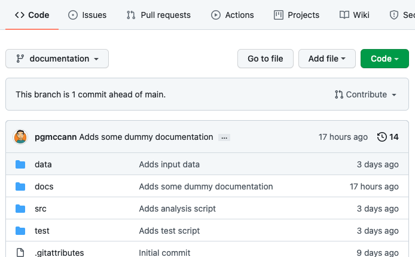
</p>

notes:

We can see the contents of our new branch in GitHub.com

--

To incorporate the changes made in the new branch into the main branch, we make
a _pull request_.

This point of the process can provide a good opportunity for collaborators to
review changes.

It's not uncommon for projects to discourage contributors from accepting their
own pull requests.

notes:

A pull request is different to a pull from a remote.

This review process need not necessarily be an exercise in finding fault. It's
often very useful to be asked to articulate why certain decisions are made, it
provides opportunity to learn and the project will be more sustainable.

--

<p class="stretch">
  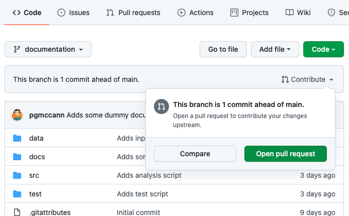
</p>

notes:

Again, GitHub invites me to open a pull request. This can also be done in
GitHub Desktop.

--

<p class="stretch">
  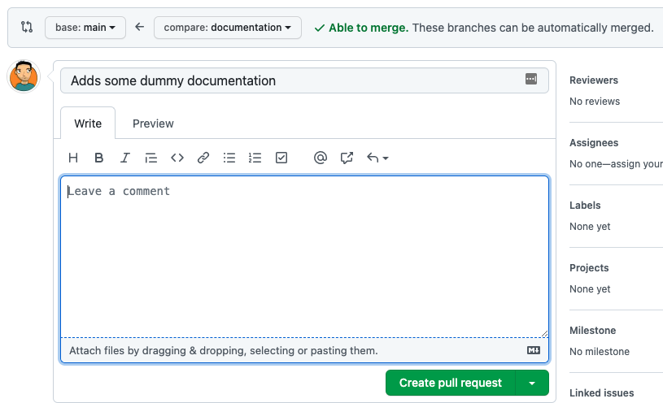
</p>

notes:

I'm asked to give some information about the changes which are to be merged
into the main branch. If there's only one commit, as in this case, then that
information will probably be the same as provided for the commit. GitHub knows
that, and uses it by default.

--

<p class="stretch">
  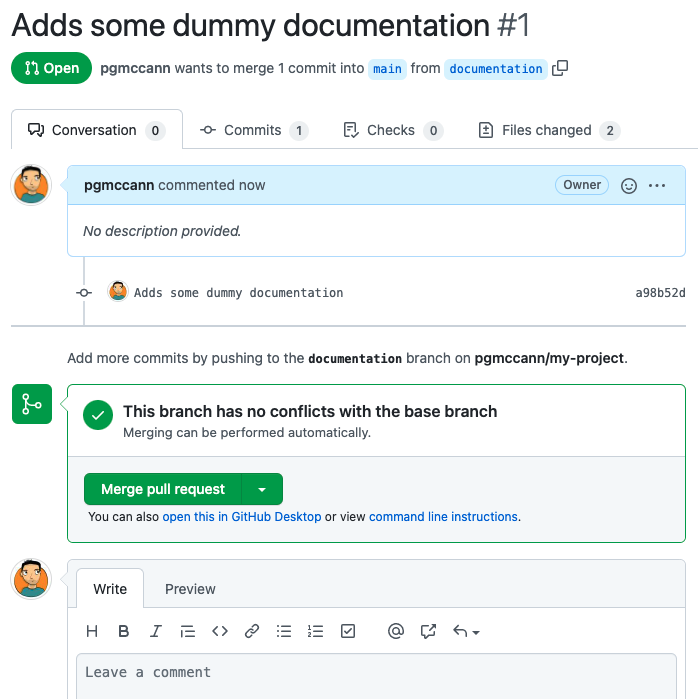
</p>

notes:

After creating the pull request, GitHub tells me it can be merged
automatically, as there are no conflicts. If there were conflicts, they would
be resolved in the same way we saw earlier.

You can enter comments here at the bottom to discuss the request.

--

<p class="stretch">
  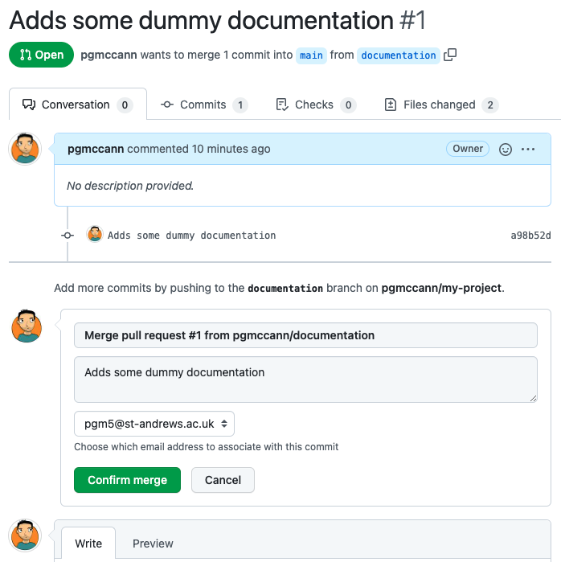
</p>

notes:

After clicking "Merge pull request" I'm asked to confirm and given another
opportunity to comment.

--

<p class="stretch">
  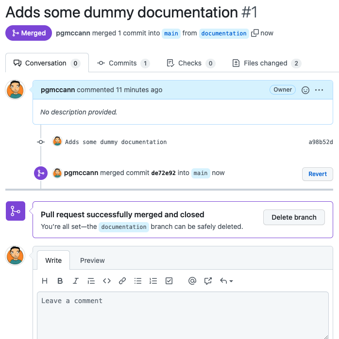
</p>

notes:

I've successfully merged the pull request. Again, if you're collaborating on a
project, it's a good idea to discourage people from merging their own pull
requests.

I'm given the option to delete the branch.

--

<p class="stretch">
  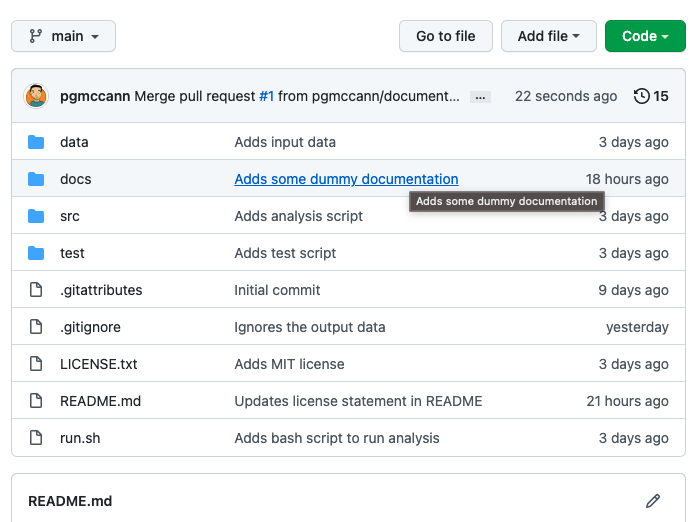
</p>

notes:

Here you can see the 'docs' folder originally created on the 'documentation'
branch on the 'main' branch after the merge.

---

## Forking

_Forking_ looks a bit like branching - we create a fork, can make changes there
without changing things elsewhere, and we can use pull requests to merge those
changes.

However, whereas branching occurs within a repository, forking takes place
across repositories.

It's really a function of platforms like GitHub and GitLab rather than a part
of Git itself.

--

Imagine coming across an open-source R package on GitHub which does exactly the
analysis you need, but the you need the output in a different format.

You can fork the repository, creating a clone of it in your GitHub account,
including all branches and commit details.

You can then make changes in your fork of the application, so that is works as
you need it to.

--

The new repo is linked to the old one. So, maybe you spot something in a
repository that needs to be fixed - could be a bug, or just a typo in the
documentation.

You can fork the repository, fix the issue, and submit a pull request to the
original repository to get your changes included there.

You can generally fork any public repository.

--

<p class="stretch">
  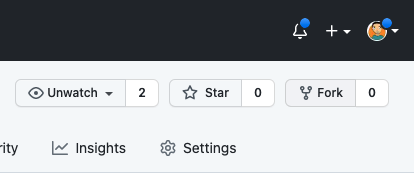
</p>

notes:

You'll see a 'Fork' button on every repository in GitHub

--

<p class="stretch">
  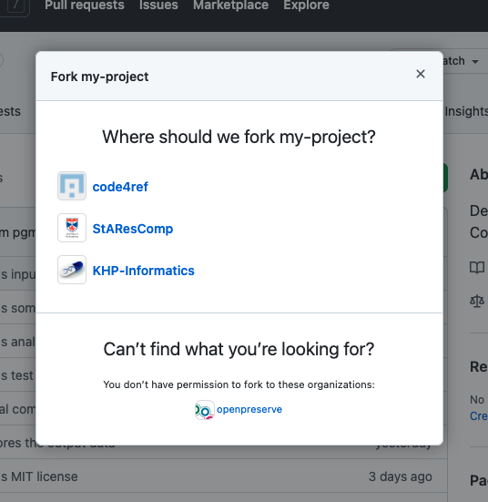
</p>

notes:

After clicking the 'Fork' button, I'm asked where I want to put the new
repository. I belong to several organisations on GitHub, so I'm asked which of
those I want it to be under. It can't be under my own account, because that's
where the original is - you can't fork to the same account as the original
repo.

--

<p class="stretch">
  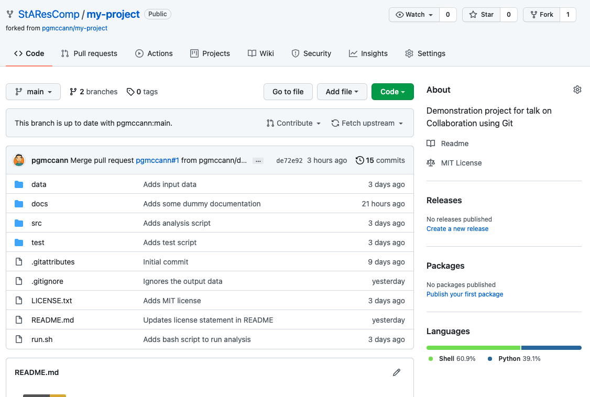
</p>

notes:

Here we can see the new repository under the StAResComp organisation, with
GitHub making clear that it is forked from the original repo under the pgmccann
account.

--

<p class="stretch">
  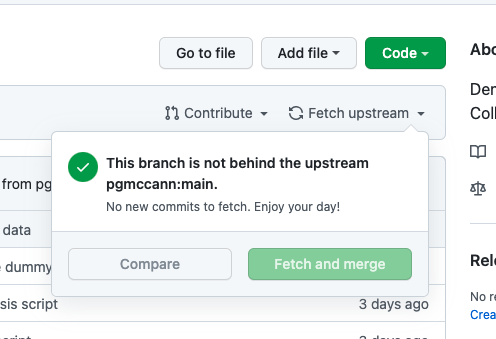
</p>

notes:

GitHub keeps track of the relative status of the new repository and the old
'upstream' one. Here we can see that no new commits have been made to main on
the upstream repo since the fork.

--

<p class="stretch">
  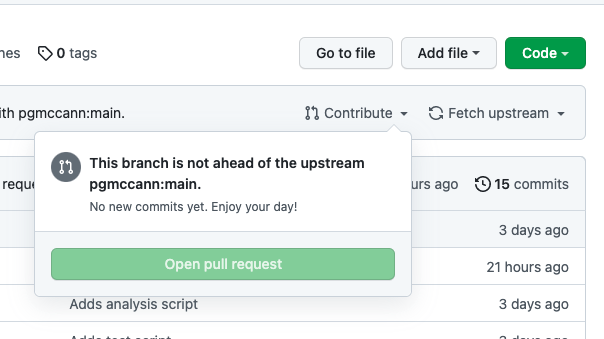
</p>

notes:

Here we can see that no commits have been made to the new repository which
would place it ahead of the upstream one. Let's change that.

--

<p class="stretch">
  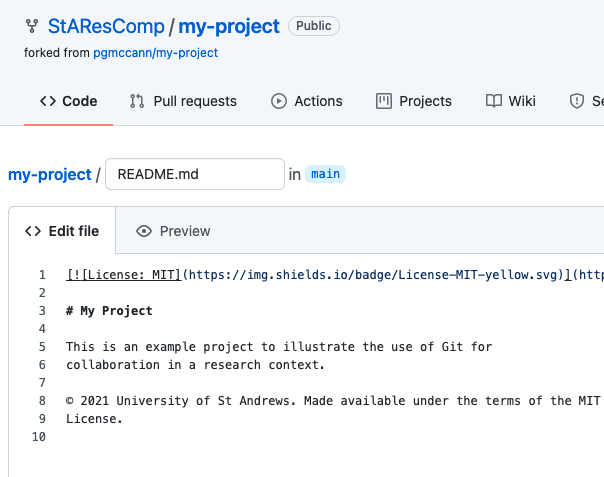
</p>

notes:

I'll edit the README in GitHub.com

--

<p class="stretch">
  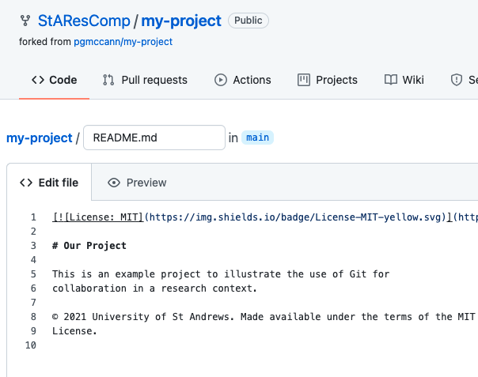
</p>

notes:

I've changed the heading.

--

<p class="stretch">
  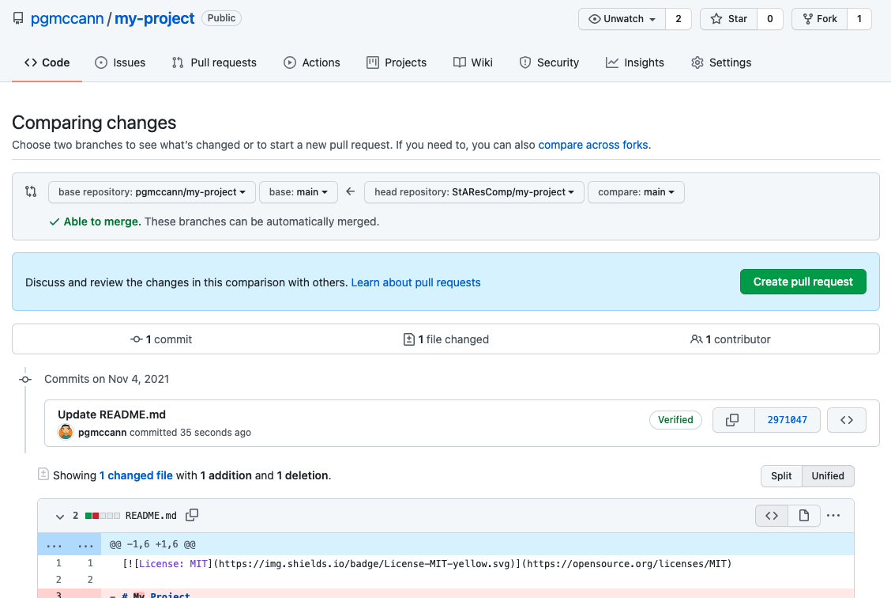
</p>

notes:

After committing I can open a pull request to get the changes included in the
upstream repo in the same way as for a branch.

--

<p class="stretch">
  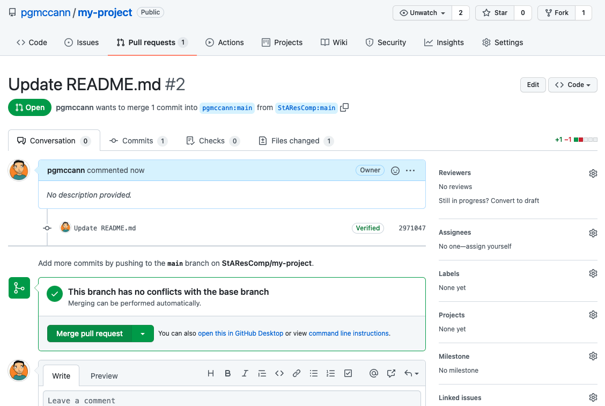
</p>

notes:

And the pull request can be merged in much the same way. Generally, it won't be
possible for you to merge your own pull request in this scenario, as you won't
have suitable permissions on the upstream repository.

---

## Open Science

Open Access Papers

&darr;

Open Data

&darr;

Open Software

notes:

Over the past few decades there has been an increasing drive to make research
publications open to all; over the past decade there has been a movement to
make the research data underpinning papers available, with many funders now
requiring it - and we're beginning to see the same principles being applied to
the software that's used to process that data.

GitHub provides a useful platform to facilitate this, and Git lends itself
towards openness.

--

Papers are not the only way to contribute to research

notes:

Alongside this is a growing recognition of the flaws in a system which
encourages the publication of as many papers as possible showing exciting,
novel results in a handful of high-profile journals.

As well as attempts to encourage things like the publication of null and
negative results, there is a recognition that research outputs other than
papers are worthy of note and reward - including software.

GitHub provides a useful service here too.

--

Make code available online under a suitable license

Make it citable (and cite software you use)

Archive your code, get a DOI and add it to Pure

notes:

We'll look at each of these in turn.

---

## Licensing

Making something public doesn't make it open-source!

You need to attach a [suitable license](https://choosealicense.com/).

notes:

By default, all rights are reserved.

---

## Citation

There are several ways to include information about how your code should be
cited.

The [Citation File Format](https://citation-file-format.github.io/) describes a
fairly simple text format, normally used in a `CITATION.cff`file.

[CodeMeta](https://codemeta.github.io) is more complex, and can capture more
metadata about the project than is relevant to citation - but the website
includes a `codemeta.json` file generator.

---

## Zenodo

GitHub's own documentation on '[Making your code
citable](https://guides.github.com/activities/citable-code/)' describes how to
archive your code and get a DOI from [Zenodo](https://zenodo.org).

You can link your GitHub account to your Zenodo account to easily archive
repositories - and every time you tag a release in GitHub, it is automatically
archived.

---

## Pure

You can also add your software to
[Pure](https://risweb.st-andrews.ac.uk/portal/). The steps involved are
described at [Code4REF](https://code4ref.github.io/).

notes:

This process will be changing soon.

---

## Other GitHub features

- Issues
- Project Management
- Automation with GitHub Actions

(All of these have equivalents in GitLab).

notes:

These are less particular to research, but GitHub's issues feature is widely
used to report problems, request features or ask for help. It now also provides
project management facilities to put those issues on Kanban boards and track
their progress.

Automation is a big topic, but there are tools available to test your software
in a number of configurations - you could automate testing of an R package with
different versions of R and other dependency packages. You could automatically
deploy a website when a change is made to the main branch. You could
automatically generate documentation - and more besides.

---

## Resources

https://software.ac.uk/resources

notes:

I was going to look for others, but looking at the wealth of stuff on the SSI
site, it didn't seem necessary.

---

## Thank-you

research-computing@st-andrews.ac.uk

https://researchcomputing.wp.st-andrews.ac.uk/team/

[Research Software in
Teams](https://teams.microsoft.com/l/team/19%3a693986665e6a401b864ca3634622ce9d%40thread.skype/conversations?groupId=fc5b43d7-ab24-4e7e-b539-f715716b3cd1&tenantId=f85626cb-0da8-49d3-aa58-64ef678ef01a)
