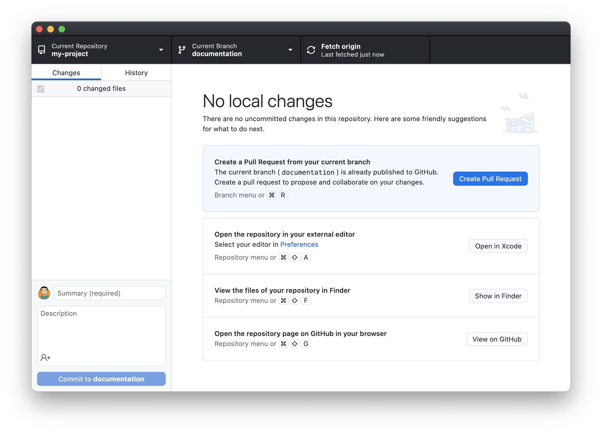

# Collaboration with Git

Patrick McCann

Research Computing, University of St Andrews

research-computing@st-andrews.ac.uk

---

## Software Carpentry

Much of this presentation will draw on the [Software
Carpentry](https://software-carpentry.org/) lesson [Version Control with
Git](https://swcarpentry.github.io/git-novice/).

That lesson goes into topics in more detail, with examples and exercises. There
are regular Software Carpentry workshops at the University, open to all
researchers.

---

## Why use Version Control?

<p class="stretch">
  
</p>

--

Version control systems record the details of changes made to a base version of
a document or documents.

As well as  allowing you to track changes over time - and to move back and
forward between versions - they allow collaborators to maintain differing
versions and provide mechanisms for resolving those differences.

--

You get to decide what changes get grouped together in a _commit_, marking a
new version.

A project's commit history and metadata make up a _repository_. Repositories
can be kept in sync between different computers.

---

## Why use Git?

<p class="stretch">
  
</p>

--

Version control systems have been around since the 1980s - you may have heard
of e.g. CVS or Subversion.

Modern systems like [Git](https://git-scm.com/) and Mercurial are
_distributed_, so they don't need a central server to host repositories.

--

Git has become the de facto standard.

---

## Why use GitHub?

<p class="stretch">
  
</p>

--

[GitHub.com](https://github.com) has become the most popular platform for
hosting Git Repositories - especially public repositories for open-source
software.

Others platforms include [BitBucket](https://bitbucket.org/) and
[GitLab.com](https://gitlab.com/).

--

The University has an instance of [GitLab](https://gitlab.st-andrews.ac.uk/)
(VPN) available to researchers - this is not available to users outside the
University.

<p class="stretch">
  
</p>

--

GitHub also provides some additional features which are particularly useful to
academic researchers.

---

## Using Git

<p class="stretch">
  
</p>

https://xkcd.com/1597/

--

There are a number of ways to work with Git on your computer:

- The command-line interface referenced in the XKCD cartoon
- Terminal based user interfaces like
  [gitui](https://github.com/extrawurst/gitui) and
  [lazygit](https://github.com/jesseduffield/lazygit/)
- Graphical user interfaces like [GitHub Desktop](https://desktop.github.com/)
  and [SourceTree](https://www.sourcetreeapp.com/)
- As a feature (or plugin) of development tools and editors like RStudio.

--

Other user interfaces can be considered as wrappers around the command-line
interface. They tend to hide some of the details of how Git works.

This presentation includes screenshots from GitHub Desktop alongside the
equivalent commands.

---

## A Git Repository

- <ion-icon name="folder-open-outline"></ion-icon> my-project
  - <ion-icon name="folder-outline"></ion-icon> .git
  - <ion-icon name="folder-outline"></ion-icon> data
  - <ion-icon name="folder-outline"></ion-icon> src
  - <ion-icon name="folder-outline"></ion-icon> test
  - <ion-icon name="document-outline"></ion-icon> .gitignore
  - <ion-icon name="document-outline"></ion-icon> LICENSE.txt
  - <ion-icon name="document-outline"></ion-icon> README.md
  - <ion-icon name="document-outline"></ion-icon> run.sh

--

<div class='left' style='float:left;width:50%'>

- <ion-icon name="folder-open-outline"></ion-icon> my-project
  - <ion-icon name="folder-outline"></ion-icon> **.git**
  - <ion-icon name="folder-outline"></ion-icon> data
  - <ion-icon name="folder-outline"></ion-icon> src
  - <ion-icon name="folder-outline"></ion-icon> test
  - <ion-icon name="document-outline"></ion-icon> .gitignore
  - <ion-icon name="document-outline"></ion-icon> LICENSE.txt
  - <ion-icon name="document-outline"></ion-icon> README.md
  - <ion-icon name="document-outline"></ion-icon> run.sh

</div>

<div class='right' style='float:right;width:50%'>

**.git** is where Git stores the metadata about the project.

We (almost) never edit its contents directly.

Technically, **.git** is the _Git Repository_, but you will often see
**my-project** described as such.

</div>

--

<div class='left' style='float:left;width:50%'>

- <ion-icon name="folder-open-outline"></ion-icon> my-project
  - <ion-icon name="folder-outline"></ion-icon> .git
  - <ion-icon name="folder-outline"></ion-icon> data
  - <ion-icon name="folder-outline"></ion-icon> src
  - <ion-icon name="folder-outline"></ion-icon> test
  - <ion-icon name="document-outline"></ion-icon> **.gitignore**
  - <ion-icon name="document-outline"></ion-icon> LICENSE.txt
  - <ion-icon name="document-outline"></ion-icon> README.md
  - <ion-icon name="document-outline"></ion-icon> run.sh

</div>

<div class='right' style='float:right;width:50%'>

Many Git-managed projects will have a **.gitignore** file, which allows us to
exclude some files from version control.

</div>

---

## Initialising

```shell
$ cd /Users/paddy/Documents/GitHub
$ mkdir my-project
$ cd my-project
$ git init
```

<p class="stretch">
  
</p>

--

```shell
$ ls -a
.       ..      .git
$ git status
On branch main
nothing to commit, working tree clean
```

<p class="stretch">
  
</p>

---

## Adding and Committing

We can add a file to our project folder using any text editor or, indeed, any
piece of software which allows us to save files.

Here, we use a text editor to create a README file using markdown syntax and
save it as `README.md`.

--

```shell
$ ls -a
.       ..      .git    README.md
$ cat README.md
# My Project

This is an example project to illustrate the use of Git for
collaboration in a research context.

```

--

<p class="stretch">
  
</p>

--

```shell
$ git status
On branch main
Untracked files:
  (use "git add <file>..." to include in what will be committed)
        README.md

nothing added to commit but untracked files present (use "git add" to track)
$ git add README.md
$ git status
On branch main
Changes to be committed:
  (use "git restore --staged <file>..." to unstage)
        new file:   README.md

```

--

```shell
$ git commit -m 'Adds basic README describing project'
```

<p class="stretch">
  
</p>

---

## Viewing the Log

<p class="stretch">
  
</p>

--

```shell
$ git log
commit c8bacfbdfd15e5f0924dde8461662ba8fdb676da
Author: Patrick McCann <pgm5@st-andrews.ac.uk>
Date:   Mon Nov 1 15:36:13 2021 +0000

    Adds bash script to run analysis

commit 3fa305a9d4e76e9a4bb58f724a15c2f5ae032edc
Author: Patrick McCann <pgm5@st-andrews.ac.uk>
Date:   Mon Nov 1 15:35:39 2021 +0000

    Adds test script

commit 382abfc258f398954ad897e52ff224a75188a7ca
Author: Patrick McCann <pgm5@st-andrews.ac.uk>
Date:   Mon Nov 1 15:32:32 2021 +0000

    Adds analysis script

commit d9342395f59895e818244e9ffbfcd3e52ee3f848
Author: Patrick McCann <pgm5@st-andrews.ac.uk>
Date:   Mon Nov 1 15:32:06 2021 +0000

    Adds input data

commit 36e0ef19bb5a33d9dffab84e807530acc360a2b5
Author: Patrick McCann <pgm5@st-andrews.ac.uk>
Date:   Mon Nov 1 15:31:26 2021 +0000

    Adds MIT license

commit 7145797baccfb6f07e3639745422ce97d383ee82
Author: Patrick McCann <pgm5@st-andrews.ac.uk>
Date:   Fri Oct 29 15:33:38 2021 +0100

    Adds basic README describing project

commit 3e2a35919aa25a688d25528c5014251cf8c5ed67
Author: Patrick McCann <pgm5@st-andrews.ac.uk>
Date:   Tue Oct 26 16:44:19 2021 +0100

    Initial commit
```

--

```shell
$ git diff HEAD~1 HEAD
diff --git a/run.sh b/run.sh
new file mode 100755
index 0000000..a84485c
 --- /dev/null
 +++ b/run.sh
@@ -0,0 +1,4 @@
+#!/bin/bash
+
+cp data/input.csv data/output.csv
+python src/analysis.py
```

--

<p class="stretch">
  
</p>

https://xkcd.com/1296/

---

## Ignoring Things

There are situations where we have a file or files in our repository which we
don't want to place under version control e.g.

- The results of analysis.
- Anything containing a password or other sensitive data.
- Files created by your tools which aren't really part of the project.

--

<p class="stretch">
  
</p>

```shell
$ git status
On branch main
Untracked files:
  (use "git add <file>..." to include in what will be committed)
        data/output.csv

nothing added to commit but untracked files present (use "git add" to track)
$ git ignore data/output.csv
Adding pattern(s) to: .gitignore
... adding 'data/output.csv'
```

--

<p class="stretch">
  
</p>

```shell
$ git status
On branch main
Untracked files:
  (use "git add <file>..." to include in what will be committed)
	.gitignore

nothing added to commit but untracked files present (use "git add" to track)
```

---

## Remotes

So far, everything has been on our own computer. This is useful, but Git really
comes into its own when collaborating with others.

To do that, we need to keep our projects in sync between multiple computers
(also useful if you work from multiple computers yourself).

Your computer is _local_, one which which you are syncing is a _remote_.

--

You can, in principle, have your Git on your computer communicate directly with
your colleagues' to keep things in sync, but it's generally easier to sync with
another location to which you all have access.

That other location could be a desktop computer in your office or it could be
GitHub (or GitLab) - as far as Git is concerned there isn't really a
difference.

--

### Creating a repo on GitHub.com

<div class='left' style='float:left;width:50%'>

<p class="stretch">
  
</p>

</div>

<div class='right' style='float:right;width:50%'>

<p class="stretch">

</p>

</div>

--

<p class="stretch">
  
</p>

--

### Publishing a repo from GitHub Desktop

<p class="stretch">
  
</p>

--

### The repo on GitHub

<p class="stretch">
  
</p>

---

## Pushing

<p class="stretch">
  
</p>

--

```shell
$ git status
On branch main
Your branch is up to date with 'origin/main'.

Changes not staged for commit:
  (use "git add <file>..." to update what will be committed)
  (use "git restore <file>..." to discard changes in working directory)
	modified:   README.md

no changes added to commit (use "git add" and/or "git commit -a")
$ git diff
diff --git a/README.md b/README.md
index e0a3173..b9fd878 100644
 --- a/README.md
 +++ b/README.md
@@ -2,3 +2,6 @@

 This is an example project to illustrate the use of Git for
 collaboration in a research context.
+
+Copyright 2021 University of St Andrews. Licensed under the terms of the MIT
+License.
```

--

After committing...

```shell
$ git status
On branch main
Your branch is ahead of 'origin/main' by 1 commit.
  (use "git push" to publish your local commits)

nothing to commit, working tree clean
$ git push
Enumerating objects: 5, done.
Counting objects: 100% (5/5), done.
Delta compression using up to 4 threads
Compressing objects: 100% (3/3), done.
Writing objects: 100% (3/3), 429 bytes | 429.00 KiB/s, done.
Total 3 (delta 1), reused 0 (delta 0), pack-reused 0
remote: Resolving deltas: 100% (1/1), completed with 1 local object.
To https://github.com/pgmccann/my-project.git
   2bf80ab..3ec775a  main -> main
```

<p class="stretch">
  
</p>

--

<p class="stretch">
  
</p>

---

## Pulling

Let's add a License
[badge](https://gist.github.com/lukas-h/2a5d00690736b4c3a7ba) using GitHub's
editing interface.

[](https://opensource.org/licenses/MIT)

--

<p class="stretch">
  
</p>

--

<p class="stretch">
  
</p>

--

<p class="stretch">
  
</p>

--

<p class="stretch">
  
</p>

--

```shell
$ git status
On branch main
Your branch is up to date with 'origin/main'.

nothing to commit, working tree clean
```

<p class="stretch">
  
</p>

--

<p class="stretch">
  
</p>

```shell
$ git pull
Updating 3ec775a..658258a
Fast-forward
 README.md | 2 ++
 1 file changed, 2 insertions(+)
```

--

<p class="stretch">
  
</p>

---

## Managing access on GitHub

My project is in a public GitHub repository, so anyone can see it - but only I
can make commits, either by editing on the GitHub website, or pushing from my
computer.

But I can add collaborators.

--

<p class="stretch">
  
</p>

--

<p class="stretch">
  
</p>

--

<p class="stretch">
  
</p>

--

<p class="stretch">
  
</p>

--

<p class="stretch">
  
</p>

---

## Merging

Knowing how to push to and pull from an remote is enough to enable
collaboration - we'll come on to some techniques which can make things easier.

We can run into complications if collaborators are working on a project at the
same time, requiring commits to be _merged_.

--

Git does as much as possible to make this painless.

It will handle merges automatically if the commits to be merged involve changes
to different files, and even if the changes are in different parts of the same
file.

If the changes are to the same part of a file, the merge will need to be
performed manually.

--

<p class="stretch">
  
</p>

--

<p class="stretch">
  
</p>

--

<p class="stretch">
  
</p>

--

<p class="stretch">
  
</p>

--

<p class="stretch">
  
</p>

--

<p class="stretch">
  
</p>

--

<p class="stretch">
  
</p>

--

<p class="stretch">
  
</p>

--

<p class="stretch">
  
</p>

--

<p class="stretch">
  
</p>

---

## Git in RStudio

<p class="stretch">
  
</p>

https://swcarpentry.github.io/git-novice/14-supplemental-rstudio/index.html

---

## Branching

_Branches_ in Git allow different versions of a project to exist in parallel,
with the repository keeping track of all of them.

Commits can be made to a branch irrespective of what's happening on any others.

Branches can be merged, with any conflicts resolved in the same way we've
already seen.

--

There are a number of reasons you might use branches, including:

- To try something out without changing the content of the main branch
- To work on different things - whether it's one person switching between them
  or collaborators working in parallel.

--

Imagine two researchers are collaborating on a piece of data analysis software.
One is working on new visualisations, and the other is working on optimising
the analysis.

<p class="stretch">
  
</p>

Some say you should never work directly on the main branch.

--

<p class="stretch">
  
</p>

--

<p class="stretch">
  
</p>

--

<p class="stretch">
  
</p>

--

<p class="stretch">
  
</p>

--

<p class="stretch">
  
</p>

--

<p class="stretch">
  
</p>

--

<p class="stretch">
  
</p>

--

<p class="stretch">
  
</p>

--

<p class="stretch">
  
</p>

--

To incorporate the changes made in the new branch into the main branch, we make
a _pull request_.

This point of the process can provide a good opportunity for collaborators to
review changes.

It's not uncommon for projects to discourage contributors from accepting their
own pull requests.

--

<p class="stretch">
  
</p>

--

<p class="stretch">
  
</p>

--

<p class="stretch">
  
</p>

--

<p class="stretch">
  
</p>

--

<p class="stretch">
  
</p>

--

<p class="stretch">
  
</p>

---

## Forking

_Forking_ looks a bit like branching - we create a fork, can make changes there
without changing things elsewhere, and we can use pull requests to merge those
changes.

However, whereas branching occurs within a repository, forking takes place
across repositories.

It's really a function of platforms like GitHub and GitLab rather than a part
of Git itself.

--

Imagine coming across an open-source R package on GitHub which does exactly the
analysis you need, but the you need the output in a different format.

You can fork the repository, creating a clone of it in your GitHub account,
including all branches and commit details.

You can then make changes in your fork of the application, so that is works as
you need it to.

--

The new repo is linked to the old one. So, maybe you spot something in a
repository that needs to be fixed - could be a bug, or just a typo in the
documentation.

You can fork the repository, fix the issue, and submit a pull request to the
original repository to get your changes included there.

You can generally fork any public repository.

--

<p class="stretch">
  
</p>

--

<p class="stretch">
  
</p>

--

<p class="stretch">
  
</p>

--

<p class="stretch">
  
</p>

--

<p class="stretch">
  
</p>

--

<p class="stretch">
  
</p>

--

<p class="stretch">
  
</p>

--

<p class="stretch">
  
</p>

--

<p class="stretch">
  
</p>

---

## Open Science

Open Access Papers

&darr;

Open Data

&darr;

Open Software

--

Papers are not the only way to contribute to research

--

Make code available online under a suitable license

Make it citable (and cite software you use)

Archive your code, get a DOI and add it to Pure

---

## Licensing

Making something public doesn't make it open-source!

You need to attach a [suitable license](https://choosealicense.com/).

---

## Citation

There are several ways to include information about how your code should be
cited.

The [Citation File Format](https://citation-file-format.github.io/) describes a
fairly simple text format, normally used in a `CITATION.cff`file.

[CodeMeta](https://codemeta.github.io) is more complex, and can capture more
metadata about the project than is relevant to citation - but the website
includes a `codemeta.json` file generator.

---

## Zenodo

GitHub's own documentation on '[Making your code
citable](https://guides.github.com/activities/citable-code/)' describes how to
archive your code and get a DOI from [Zenodo](https://zenodo.org).

You can link your GitHub account to your Zenodo account to easily archive
repositories - and every time you tag a release in GitHub, it is automatically
archived.

---

## Pure

You can also add your software to
[Pure](https://risweb.st-andrews.ac.uk/portal/). The steps involved are
described at [Code4REF](https://code4ref.github.io/).

---

## Other GitHub features

- Issues
- Project Management
- Automation
  - GitHub Actions
  - Travis CI

---

## Resources

https://software.ac.uk/resources

---

## Thank-you

research-computing@st-andrews.ac.uk

https://researchcomputing.wp.st-andrews.ac.uk/team/

[Research Software in
Teams](https://teams.microsoft.com/l/team/19%3a693986665e6a401b864ca3634622ce9d%40thread.skype/conversations?groupId=fc5b43d7-ab24-4e7e-b539-f715716b3cd1&tenantId=f85626cb-0da8-49d3-aa58-64ef678ef01a)
